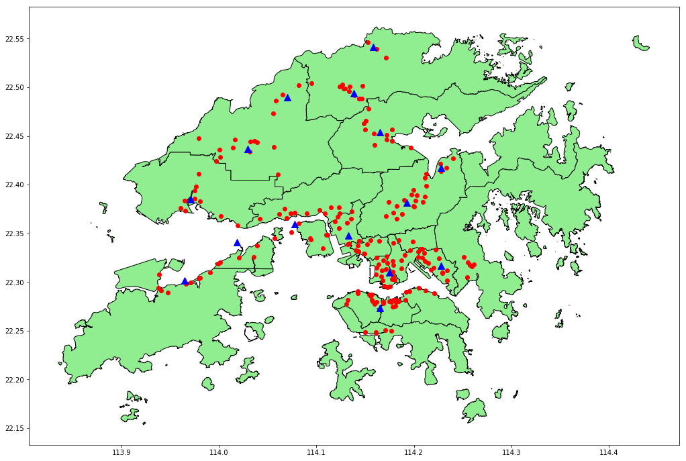

# Clustering locations of traffic cameras in Hong Kong using Amazon SageMaker and the k-means algorithm

This project contains a [Jupyter notebook](traffic-cameras-k-means.ipynb), together with the relevant geospatial data, that demonstrates how to use [Amazon SageMaker](https://aws.amazon.com/sagemaker/) and the [k-means alogrithm](https://docs.aws.amazon.com/sagemaker/latest/dg/k-means.html) to determine clusters for the locations of traffic cameras in Hong Kong.

Below is an example visualisation for *k = 15*, with red dots representing traffic camera locations, and blue triangles representing cluster centroids.

For instructions on how to run this using a SageMaker Notebook, see [here](https://github.com/rmlowe/traffic-cameras-geopandas/blob/master/README.md#using-amazon-sagemaker-notebooks). Note that you will need to ensure that the notebook instance is using a role that has permission to write to the S3 bucket specified using the `bucket_name` variable.